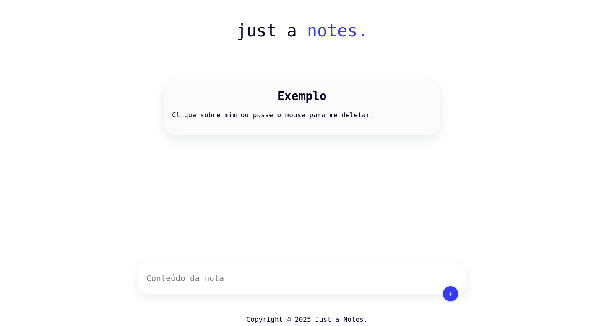

[JAVASCRIPT__BADGE]: https://img.shields.io/badge/Javascript-000?style=for-the-badge&logo=javascript
[REACT__BADGE]: https://img.shields.io/badge/React-005CFE?style=for-the-badge&logo=react
[PROJECT__BADGE]: https://img.shields.io/badge/📲_Veja_o_projeto-000?style=for-the-badge&logo=project
[PROJECT__URL]: notes-nine-indol.vercel.app

<h1 align="center" style="font-weight: bold;">Notes 🗒️</h1>

![react][REACT__BADGE] ![javascript][JAVASCRIPT__BADGE]

<p align="center">
 <a href="#about">Sobre</a> • 
 <a href="#started">Como rodar </a> • 
  <a href="#colab">Colaboradores</a> •
 <a href="#contribute">Links</a>
</p>
<p align="center">
    
</p>

<h2 id="started">📌 Sobre</h2>
O projeto notes é um marco muito importante para mim! É um marco para mim, é como se fosse um "TCC" do modulo do front end do curso Full Stack Turbo. E estou muito feliz com minhas novas habilidades!

[![project][PROJECT__BADGE]][PROJECT__URL]

<h2 id="started">🚀 Como rodar </h2>

Clonar o repositório e apenas instalar as dependências

<h3>Requisitos</h3>

- [NodeJS](https://nodejs.org/pt/download)
- [Git](https://git-scm.com/docs/git-init)

<h3>Clonar</h3>

Primeiro vamos clonar o repositório.

```bash
git clone https://github.com/Rafael-Machado01/notes
```

<h3>Executar</h3>

```bash
cd notes
npm i
npm start
```
<h2 id="colab">📖 Linçenca</h2>
Sem restrição, incluindo, sem limitação, os direitos de usar, copiar, modificar, mesclar, publicar, distribuir, sublicenciar e/ou vender cópias do projeto.
<h2 id="colab">🤝 Colaborades</h2>

Um agradecimento especial a todas as pessoas que contribuíram para o nosso projeto.

<table>
  <tr>
    <td align="center">
      <a href="#">
        <br>
        <sub>
          <b>Fernanda Kipper</b>
        </sub>
      </a>
    </td>
    <td align="center">
      <a href="https://github.com/alissonsuassuna">
        <br>
        <sub>
          <b>Alisson Suasuna</b>
        </sub>
      </a>
    </td>
  </tr>
</table>


<h3>Documentações que podem ajudar</h3>

[💎 React](https://pt-br.react.dev/learn)
[🚀 Create React App](https://create-react-app.dev/)
[📱 React Icons](https://react-icons.github.io/react-icons/)
[🪄 React BootStrap](https://create-react-app.dev/docs/adding-bootstrap/)
[👦🏻LikedIn Criador](https://www.linkedin.com/in/rafael-machado-ampudia/)


